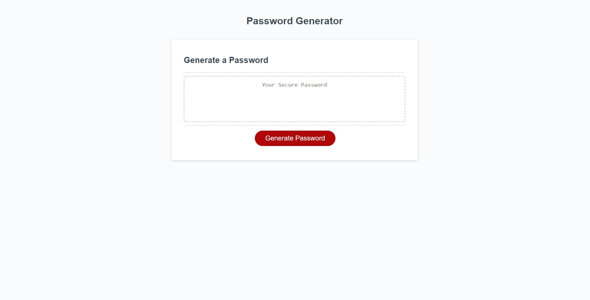

# Random Password Generator

This project is a random password generator implemented using JavaScript. It allows users to generate a password based on specified criteria, such as length and character types. The generated password is then displayed on the screen.

The site can be accessed [here](https://jonesmatr.github.io/Password-Generator/).


## Table of Contents

- [About](#about)
- [Installation](#installation)
- [Usage](#usage)
- [Credits](#credits)

## About

The random password generator is a useful tool for creating secure and unique passwords. It helps users generate passwords that are difficult to guess, providing an added layer of security for their accounts and sensitive information.

The generator allows users to customize the length of the password and choose the types of characters to include, such as lowercase letters, uppercase letters, numbers, and special characters. By offering these options, users can create passwords that meet the specific requirements of different websites and applications.

## Installation

To use the random password generator, follow these steps:

1. Clone the repository to your local machine using the following command:
```bash
git clone https://github.com/jonesmatr/Password-Generator.git
``` 
2. Open the `index.html` file in a web browser.

## Usage

1. Open the password generator in your web browser.
2. Click on the "Generate Password" button.
3. A prompt will appear, asking you to enter the desired password length (between 8 and 128 characters).
4. Enter the desired length and click "OK".
5. A series of confirm prompts will appear, asking you to select the character types to include in the password.
6. Click "OK" for the character types you want to include and "Cancel" for the ones you want to exclude.
7. Once all the prompts are completed, the generated password will be displayed on the screen.

Ensure that you remember or securely store the generated password, as it will not be saved or stored anywhere by the generator.

## Credits

This random password generator project was created by Matthew Jones. It was developed using HTML, CSS, and JavaScript. The project is based on starter code provided by the University of Richmond Boot Camp. 

The following websites were also used to help with the respective section of code:

- [parseInt](https://developer.mozilla.org/en-US/docs/Web/JavaScript/Reference/Global_Objects/parseInt)
- [isNaN](https://www.w3schools.com/jsref/jsref_isnan.asp), 
- [isNaN (MDN)](https://developer.mozilla.org/en-US/docs/Web/JavaScript/Reference/Global_Objects/isNaN)
- [Password Validation (Stack Overflow)](https://stackoverflow.com/questions/50822886/password-characters-checker-in-javascript)
- [Password Validation (w3schools)](https://www.w3schools.com/howto/howto_js_password_validation.asp)
- [Regular Expressions (Stack Overflow)](https://stackoverflow.com/questions/18812317/javascript-regex-for-special-characters)